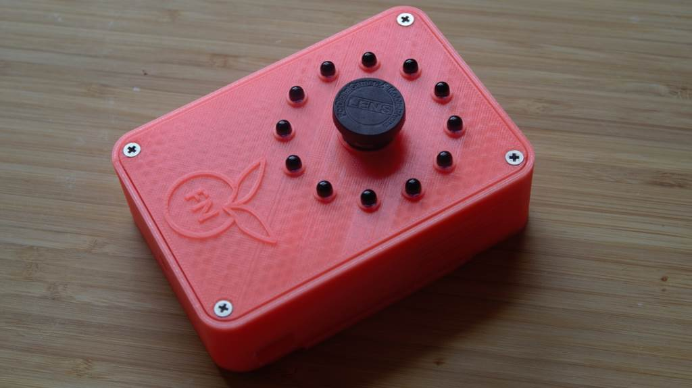
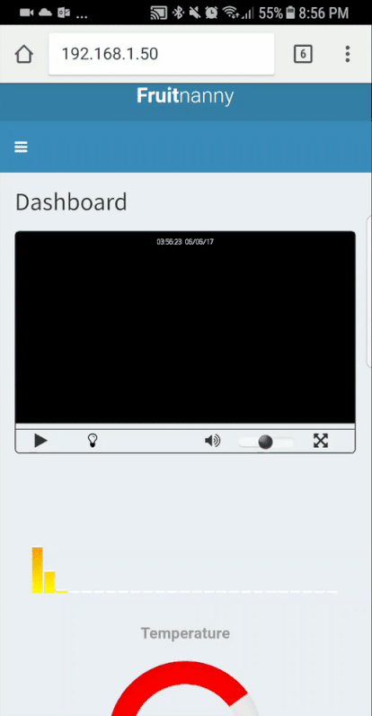

# Overview

**Fruitnanny** is a code name for a DIY *geek* baby monitor. 
It uses RaspberryPi, a NoIR camera module, infrared lights, temperature and humidity sensors, and a custom Web UI. 
Chrome and Firefox with native WebRTC are used as clients. 
Right now it means support of all major platforms like Windows, Linux, Android, MacOS and iOS.

This repository contains NodeJS application and configurations files.

For more information: https://ivadim.github.io/2017-08-21-fruitnanny/

# How to setup

Follow [installation instruction](INSTALLATION.md)

# Tested platforms (docker-based installation)

* Windows 10 (64 bit) 
  * Chrome 77.0.3865.120 👍 
  * Firefox 70.0 👍  
* macOS 10.14.6
  * Safari 13.0.2 👍 
  * Chrome 78.0.3904.70 👍 
  * Firefox 70.0 👍 
* Linux (64 bit, Debian testing)
  * Chrome 78.0.3904.70 👍 
  * Chromium 76.0.3809.100 (latest in Debian repo) 👎 (Reports a failure to negotiate STP, I think it doesn't have the correct codecs)
  * Firefox 60.8.0esr (latest in Debian repo) 👎 
  * Firefox 70.0 (downloaded from Mozilla) 👍 
* Android
  * Chrome 78.0.3904.62 👍 
  * Firefox (latest stable) 👎
* iOS (13.1, Xcode emulator)
  * Safari 👍 

# Configuration

Modify [fruitnanny_config](./fruitnanny_config.js) to configure the baby monitor.

Params:
* `baby_name` - baby's name to display in UI
* `baby_birthday` - baby's birthday
* `temp_unit` - temperature to display in Celsius (`C`) or Fahrenheit(`F`)

> Restart the system after change

To update baby's picture you need to replace file `public\project\img\baby.png`.

# How to build and run locally

* Install nodejs
* Run `npm install`
* Run `npm run grunt`
